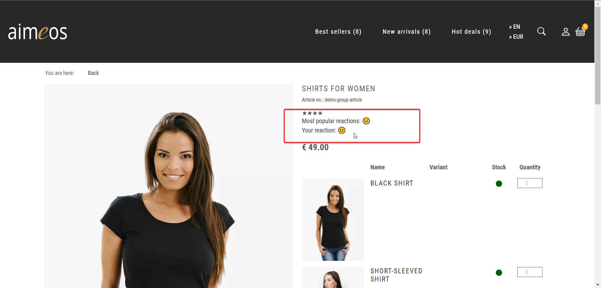

This repository contains module to add Emoji functionality to <a href='https://github.com/aimeos/aimeos-laravel'>aimeos/laravel</a> store.


To install this project please clone repository to your local machine and run this command

1. Copy .env.example to .env
2. Fill .env with your configurations
3. Run command to add emojis and install dependencies
```
composer req aimeos-extensions/emoji
```
4. Install demo store
```
php artisan aimeos:setup --option=setup/default/demo:1 
```
5. To start project use this command
```
php artisan serve
```

All functionality should appear like on screen

Frontend


Backend

